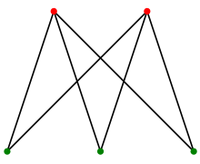

# 이분그래프 (bipartite graph)

인접한 정점끼리 서로 다른 색으로 칠하여 모든 정점을 두 그룹으로 나누고, 서로다른 그룹의 정점을 간선으로 연결한 그래프.

=> 모든꼭짓점을 빨강과 파랑으로 색칠하되 모든 변이 빨강과 파랑을 꼭짓점으로 포함하도록 색칠할 수 있는 그래프

- 이분그래프 판단법  
다음 정점의 색과 현재 정점의 색이 같다면 이분그래프가 아니다.
